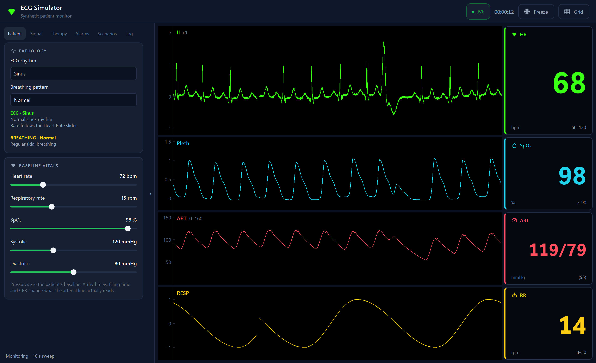
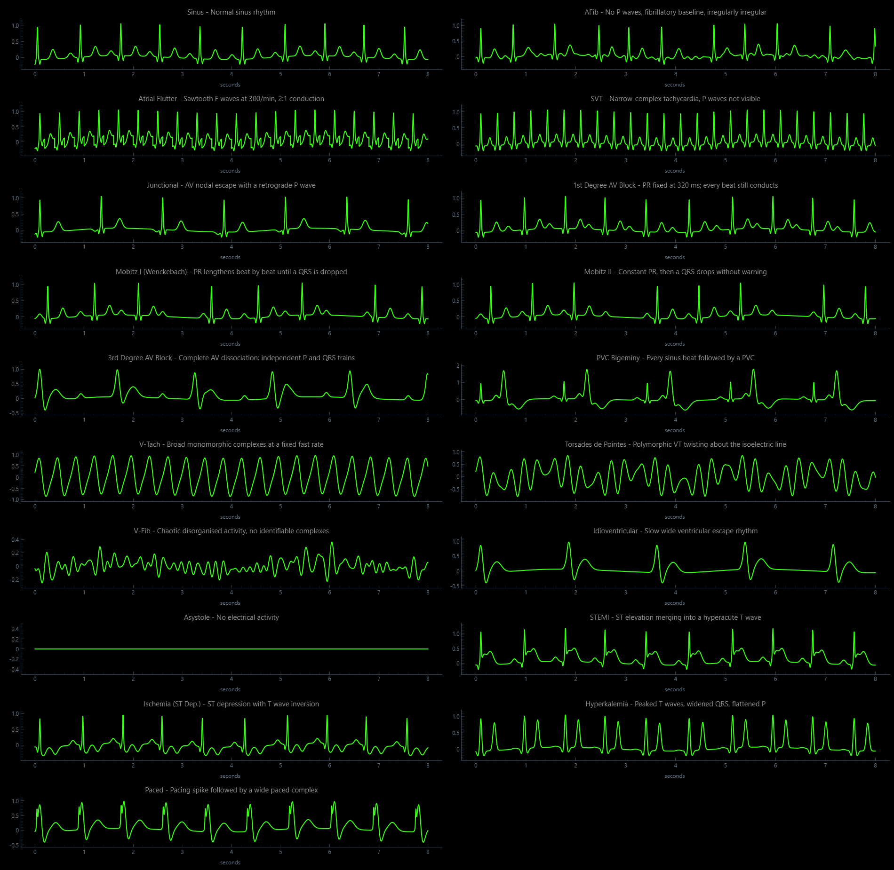
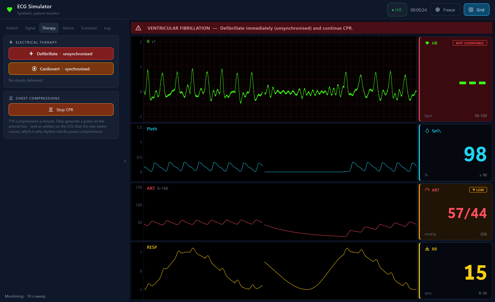
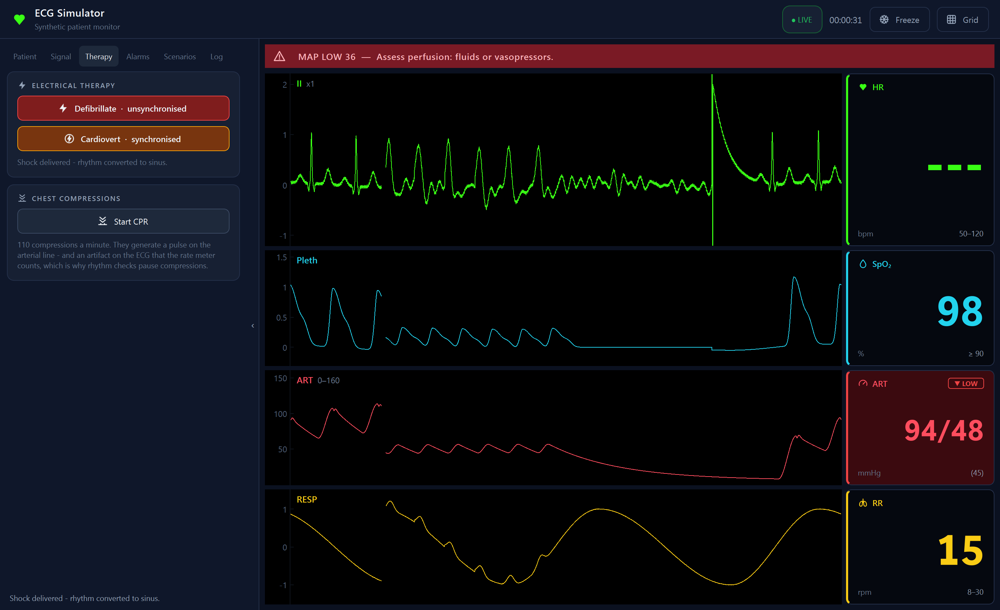
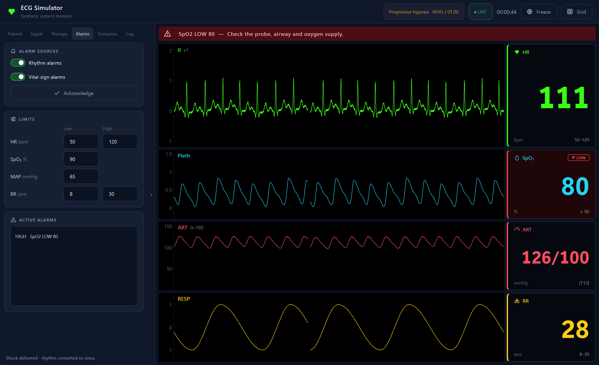
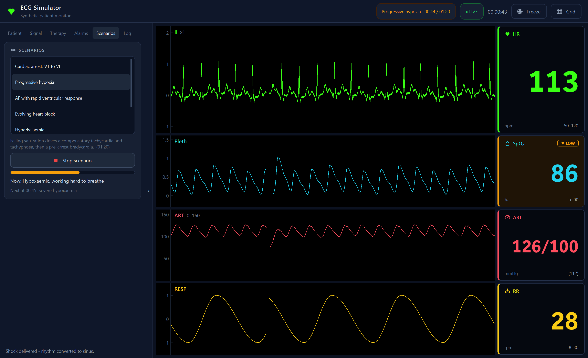

# ECG Simulator

A real-time patient monitor driven by a physiological model. It generates ECG,
pulse oximetry, arterial pressure and respiration — 19 cardiac rhythms, 6
breathing patterns — and reads its own numerics off those waveforms the way a
bedside monitor does. Arrhythmias, CPR, defibrillation and scripted clinical
scenarios all play out across every channel at once.

Built for teaching, demos, and testing signal-processing code against known
input. Nothing here comes from a real patient.



## Download

Prebuilt binaries are on the [Releases page](../../releases). Download the one
for your platform, unzip, and run — there is nothing to install.

| Platform | File |
|---|---|
| Windows 10/11 (64-bit) | `ECG-Simulator-windows-x64.zip` |
| macOS (Apple Silicon) | `ECG-Simulator-macos-arm64.zip` |

Intel Macs have no prebuilt binary — an Intel machine cannot run an Apple
Silicon build, so run it from source instead (below).

The binaries are not code-signed, so both operating systems will object the
first time:

- **macOS** — right-click the app and choose **Open**, then confirm. (Double-clicking
  will only offer to move it to the bin.) Or from a terminal:
  `xattr -dr com.apple.quarantine "ECG Simulator.app"`
- **Windows** — SmartScreen shows "Windows protected your PC". Choose
  **More info → Run anyway**.

## Run from source

```bash
pip install -r requirements.txt
python main.py
```

Python 3.10 or newer. Developed against Python 3.14 with PyQt6 6.11,
pyqtgraph 0.14, numpy 2.5 and scipy 1.18 (scipy is only needed for the tests).

## The display

Four waveform rows, each beside the number it produces — the layout every
bedside monitor uses:

| Row | Waveform | Numeric |
|---|---|---|
| **II** | ECG | Heart rate, from a QRS detector |
| **Pleth** | Pulse oximeter volume wave | SpO₂ |
| **ART** | Arterial line pressure | Systolic / diastolic (mean) |
| **RESP** | Thoracic impedance | Respiratory rate |

The numbers are **measured from the waveforms, not echoed from the controls.**
V-Tach reads 160 whatever the heart-rate slider says, AFib's rate wanders beat to
beat, a motion artifact can briefly fool the rate meter, and in VF the heart
rate reads `---` because there is nothing countable. When a pulse is lost, the
pressure and saturation go with it.

A value outside its alarm limit gets a text badge — `▲ HIGH`, `▼ LOW`,
`NO PULSE`, `APNOEA` — as well as a colour, so alarm state never depends on
colour vision.

## Using it

The left panel has six tabs. `Ctrl+H` (or `F9`) collapses it to give the
waveforms the full width; the thin rail on its edge brings it back.

**Patient** — the ECG rhythm, the breathing pattern, and the patient's
baseline heart rate, respiratory rate, SpO₂ and blood pressure. A short
description explains what the selected rhythm changes, including when it takes
over the rate and leaves the heart-rate slider inactive.

**Signal** — mains hum, baseline wander and sensor noise; ECG gain and an ECG
paper grid; one-click injection of a motion artifact or a premature ventricular
contraction; and CSV export of the visible 10 seconds of every channel.

**Therapy** — unsynchronised defibrillation, synchronised cardioversion, and
CPR.

**Alarms** — rhythm and vital-sign alarms each switch on and off; limits for
heart rate, SpO₂, mean pressure and respiratory rate; the list of active alarms;
and **Acknowledge**, which stops them flashing for a minute.

**Scenarios** — scripted cases that change the patient over a minute or two.

**Log** — a timestamped record of everything that happened, from whichever
source: a control, a scenario step, a shock, an alarm raised or cleared.

| Key | Action |
|---|---|
| `Space` | Freeze the waveforms (the patient keeps going underneath) |
| `Ctrl+G` | ECG paper grid |
| `Ctrl+E` | Export to CSV |
| `Ctrl+H` / `F9` | Collapse or restore the control panel |

## What it simulates

### Cardiac rhythms

| | |
|---|---|
| Normal | Sinus |
| Atrial | AFib, Atrial Flutter, SVT, Junctional |
| Conduction blocks | 1st Degree, Mobitz I (Wenckebach), Mobitz II, 3rd Degree |
| Ventricular | PVC Bigeminy, V-Tach, Torsades de Pointes, V-Fib, Idioventricular, Asystole |
| Ischaemic / metabolic | STEMI, Ischemia (ST depression), Hyperkalemia |
| Device | Paced |



The conduction blocks are modelled as conduction, not just as a different beat
shape: Wenckebach's PR interval lengthens by a shrinking increment until a QRS
is dropped, and complete heart block runs the atria and ventricles on
independent clocks so the P waves drift through the cycle.

### Breathing patterns

Normal, Cheyne-Stokes, Kussmaul, Biot (ataxic), apnoea, and agonal gasping.


### Circulation

Arterial pressure and the pleth come from a model of the circulation driven by
each simulated heartbeat, not from a per-rhythm script. How much blood a beat
moves depends on how long the ventricle had to fill and how effectively the
rhythm contracts it, so the consequences emerge on their own:

- a PVC produces a **weak pulse**, and the beat after its pause a **stronger** one;
- a dropped beat in heart block produces **no pulse at all**;
- SVT at 180 goes hypotensive with a narrow pulse pressure, while complete heart
  block gives the classic wide one;
- V-Tach collapses the pressure, and in VF or asystole it decays to a flat line.

The blood-pressure controls set the patient's baseline at a resting heart rate;
everything above then changes what the arterial line actually reads.

### Electrical therapy and CPR

Defibrillation and synchronised cardioversion behave the way the equipment
does, which is most of the point of simulating them:

- **Asystole is never shockable.** It does not matter how many times you press
  the button — a flat line needs CPR, not electricity.
- **Cardioversion cannot synchronise without an R wave.** Attempt it in VF and
  the shock is simply not delivered.
- **An unsynchronised shock into an organised rhythm can induce VF** by landing
  on the T wave. That is the reason cardioversion is synchronised at all.

Shocks succeed probabilistically rather than always working, and the outcome is
stated plainly, so a failed shock reads as a modelled result rather than a bug.

**CPR** delivers 110 compressions a minute. Each one pushes blood — so during an
arrest the arterial line and pleth show pulses again — and each one puts an
artifact on the ECG that the rate meter counts. That is why real resuscitation
pauses compressions to check the rhythm, and it is visible here.



Above: VF with the ECG grid on. Where compressions are running the pleth and
arterial line carry pulses; where they paused, mid-sweep, both go flat.



Above, read left to right as a single sweep: sinus rhythm, VF with CPR, the
compressions stopping and the pressure decaying, the shock artifact, a
post-shock pause, then sinus rhythm returning — with pulses recovering on the
pleth and the arterial line.

### Alarms

Two kinds, both switchable:

- **Rhythm alarms** — when the rhythm itself calls for intervention: flashing red
  for arrest rhythms, steady amber for unstable-but-perfusing ones, each with a
  line of guidance.
- **Vital-sign alarms** — measured numerics outside their limits, escalating to
  high priority when critical. The most urgent one also reaches the banner, so
  apnoea or a lost pulse is never confined to a tile nobody is watching.

Alarms are debounced the way monitors do it: a condition must persist before it
raises, and stay gone before it clears. A heart rate hovering on its limit would
otherwise raise and clear an alarm every few seconds.



### Scenarios

| Scenario | What happens |
|---|---|
| Cardiac arrest: VT to VF | Ectopy degenerates through VT into VF |
| Progressive hypoxia | Falling saturation, compensatory tachycardia, then pre-arrest bradycardia |
| AF with rapid ventricular response | New AF, rising rate, falling pressure |
| Evolving heart block | First degree through Wenckebach and Mobitz II to complete block |
| Hyperkalaemia | Peaked T waves, a wide slow escape rhythm, then VF |
| Opioid overdose | Respiratory depression to agonal breathing and apnoea |

Each starts the patient from a fixed baseline so it plays out the same way
every time, while leaving the noise and alarm settings as you had them.



## How it works

Each heartbeat is a sum of five Gaussians — a simplified McSharry model — in the
order P, Q, R, S, T:

$$z(t) = \sum_i a_i \exp\left(\frac{-(t - \theta_i)^2}{2b_i^2}\right)$$

The P and T waves migrate toward the QRS as the rate rises, following Bazett's
square-root relationship, while the QRS keeps its width. Respiration is a
phase-warped asymmetric wave with a controllable inspiratory:expiratory ratio,
coupled back into the ECG both as respiratory sinus arrhythmia and as a slow
baseline sway.

Every ventricular beat ejects a stroke volume into a two-element Windkessel —
the arterial tree as a compliance draining through a peripheral resistance:

$$C \frac{dP}{dt} = Q(t) - \frac{P - P_v}{R}$$

Stroke volume follows the Frank-Starling relationship with the filling time the
preceding interval allowed. `R` and `C` are calibrated so the reference patient
reads the blood pressure you set.

The numerics come from signal processing on the generated waveforms: a
Pan-Tompkins-style QRS detector with T-wave rejection, a regularity-and-
prominence test that separates fibrillation from irregular-but-organised
rhythms like AFib, beat-by-beat pressure measurement, and a breath detector
with a 30-second window so even agonal breathing at 6 a minute is counted.

Generation and display run on separate threads with a ring buffer between them,
so a slow repaint can never stall the sample clock:

```
SignalGenerator (QThread) --writes--> RingBuffer <--reads-- MonitorView
     50 ms chunks                  10 s @ 1 kHz          QTimer, 30 FPS
```

The display does not scroll. The x-axis is fixed at 0–10 s and the trace stays
where it was drawn; a block of `NaN` samples is blanked just ahead of the write
cursor, so what travels across the screen is the *gap* — the erase bar of a real
monitor.

```
main.py               entry point
core/state.py         thread-safe parameter state and one-shot event flags
core/buffer.py        fixed-size multi-channel ring buffer
core/pathology.py     catalogue: morphologies, rhythms, breathing, therapy
core/generator.py     waveform engine and producer thread
core/hemodynamics.py  Windkessel circulation, arterial pressure, pleth
core/vitals.py        numerics measured from the waveforms
core/alarms.py        alarm limits, priorities and debouncing
core/scenarios.py     scripted clinical scenarios
ui/theme.py           colours, type and the stylesheet
ui/icons.py           vector icon set, drawn in code
ui/widgets.py         sliders, switches, tiles, alarm banner, event log
ui/monitor.py         sweeping waveforms and numeric tiles
ui/main_window.py     control panel, header, and the wiring between them
```

`core/pathology.py` is a data table. Adding a rhythm means editing that file
rather than the engine; the dropdown and the in-app description pick it up
automatically.

## Development

207 tests across nine suites. They assert on measurements taken back out of the
generated signal — R-R intervals, FFT bins, QRS widths, pressures, pulse timing —
rather than on the fact that numbers came out.

```bash
python tests/test_core.py         # ring buffer, state
python tests/test_generator.py    # waveform models, producer thread
python tests/test_ui.py           # widgets, layout, panel collapse
python tests/test_sweep.py        # sweep cursor, wiring, CSV export
python tests/test_pathology.py    # AFib, STEMI, V-Tach, Cheyne-Stokes
python tests/test_rhythms.py      # the full catalogue
python tests/test_therapy.py      # defibrillation, cardioversion, rhythm alarms
python tests/test_physiology.py   # circulation, measured vitals, alarms, CPR, scenarios
python tests/test_monitor_ui.py   # numerics on screen, display controls, the event log
```

They also run under `pytest`. The GUI suites need a real window server; the
core suites run headless.

Three preview tools render the waveforms and the app to PNG for inspection:

```bash
python tests/preview_waveforms.py
python tests/preview_pathology.py
python tests/preview_window.py out.png AFib Cheyne-Stokes
```

### Building

```bash
pip install pyinstaller
python packaging/make_icon.py     # optional, Windows icon
pyinstaller ECG-Simulator.spec --noconfirm --clean
```

Windows produces a single `dist/ECG-Simulator.exe`; macOS produces
`dist/ECG Simulator.app`. PyInstaller does not cross-compile, so each platform's
binary has to be built on that platform — the GitHub Actions workflow in
`.github/workflows/release.yml` does both on hosted runners.

## Not a medical device

Every waveform here is synthetic and hand-parameterised, and every model is a
simplification. Nothing is derived from patient data or validated against any
clinical standard. It must not be used for diagnosis, for training that
substitutes for clinical instruction, or to test equipment intended for
patient care.
